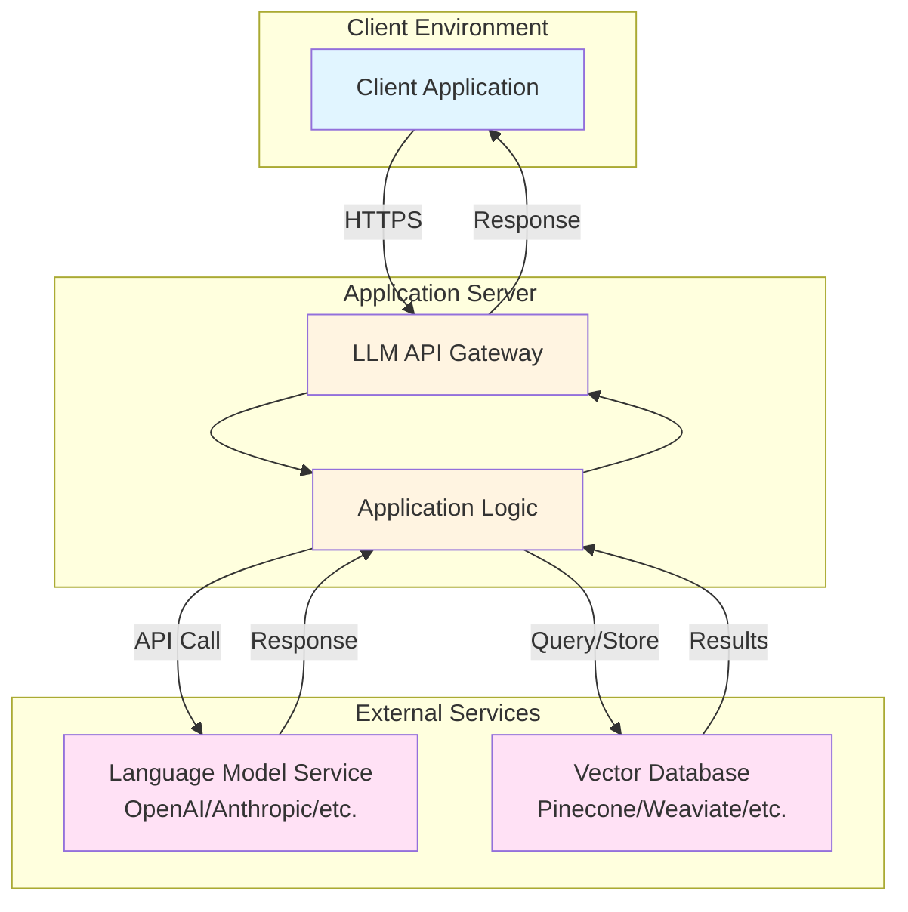
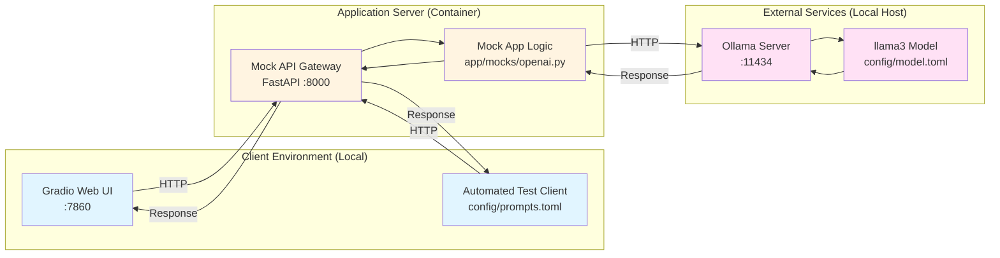

# LLM Mock API Template

## Overview
This repository provides a template for creating mock API servers to test LLM applications locally. It includes a FastAPI-based mock server with modular service implementations, automated testing, client scripts, and container orchestration using **Podman**.

The template currently includes a mock OpenAI API endpoint that uses a local Ollama instance as the backend, allowing you to test LLM integrations without incurring API costs.

## Architecture

### Production Deployment (Target Architecture)



### Local Mock Setup (This Template)



**Mapping to Production:**
- **Client Environment** → Local browser/scripts (instead of remote client)
- **Application Server** → Containerized mock API (instead of cloud deployment)
- **External Services** → Local Ollama + model (instead of cloud LLM/VectorDB)

## Prerequisites
- **Python 3.10** (or newer, but <3.11)
- **uv** – Python package manager (`pip install uv` if not already installed)
- **Podman** (or Docker – replace `podman` with `docker` in the Makefile if desired)
- **Ollama** (Local LLM runner)

## Local Ollama Setup
1. Install [Ollama](https://ollama.com/).
2. Pull a model (e.g., Llama 3):
   ```bash
   make ollama-pull
   ```
3. Start the Ollama server (usually runs automatically):
   ```bash
   ollama serve
   ```
   - **Note**: The containerized app accesses Ollama on the host via `host.containers.internal:11434`

## Configuration

### Model Configuration (`config/model.toml`)
Controls which LLM model to use:
```toml
[default]
model = "llama3"  # Change to switch models

[ollama]
base_url = "http://host.containers.internal:11434/v1"
```

### Test Prompts (`config/prompts.toml`)
Defines automated test prompts organized by category:
- `basic` - Simple functionality tests
- `custom` - Your own test prompts

## Quick Start

```bash
# View all available commands
make help

# Full automated setup and launch Gradio UI
make gradio

# Or step-by-step:
make install      # Install uv
make sync         # Install dependencies
make build        # Build container
make up           # Start container
make test         # Test health endpoint
```

The mock API will be available at `http://localhost:8000`.

## Available Commands

Run `make help` to see all commands:

**Container Operations:**
- `make build` - Build the container image
- `make up` - Run the container
- `make down` - Stop and remove the container
- `make clean` - Clean up containers and images

**Development:**
- `make install` - Install uv package manager
- `make sync` - Sync/install dependencies
- `make lock` - Update dependency lock file

**Testing:**
- `make test` - Full setup + health check
- `make test-client` - Run automated prompt tests

**UI:**
- `make gradio` - Full setup + launch Gradio web interface

**Code Quality:**
- `make format` - Run black and isort formatters
- `make mypy` - Run mypy type checker

**Ollama:**
- `make ollama-pull` - Pull llama3 model
- `make ollama-serve` - Start Ollama (checks if already running)

## Testing the Mock API

### Health Check
```bash
curl http://localhost:8000/health
```
Expected response: `{"status": "ok"}`

### Chat Completion
```bash
curl -X POST http://localhost:8000/v1/chat/completions \
-H "Content-Type: application/json" \
-H "Authorization: Bearer sk-mock-key" \
-d '{
  "model": "llama3",
  "messages": [{"role": "user", "content": "Hello!"}]
}'
```

### Automated Testing
Run the test suite with prompts from `config/prompts.toml`:
```bash
make test-client
```

Output includes:
- Test results for each prompt category
- Success/failure status
- Response previews
- Summary statistics

### Gradio Web Interface
Interactive chat interface:
```bash
make gradio
```
Opens at `http://localhost:7860` with a user-friendly chat UI.

## Project Structure
```
.
├── config/                   # Configuration files
│   ├── model.toml           # Model settings (default model, Ollama config)
│   └── prompts.toml         # Test prompts for automated testing
├── data/                     # Placeholder for document files
├── app/                      # FastAPI mock server package
│   ├── __init__.py
│   ├── main.py              # FastAPI entry point
│   └── mocks/               # Modular mock service implementations
│       ├── __init__.py
│       ├── openai.py        # Mock OpenAI API using Ollama
│       └── README.md        # Guide for adding new mocks
├── client/                   # Client scripts
│   ├── main.py              # Automated test runner
│   └── gradio_app.py        # Web UI client
├── threat_model/            # Threat modeling artifacts
├── Containerfile            # Podman container definition
├── entrypoint.sh            # Container entrypoint script
├── podman-compose.yml       # Orchestration configuration
├── Makefile                 # Developer commands
├── pyproject.toml           # uv project definition
├── uv.lock                  # Lock file generated by uv
└── README.md                # This file
```

## Adding New Mock Services

The template is designed to be easily extensible. To add a new mock service (e.g., Pinecone, Anthropic, etc.):

1. Create a new module in `app/mocks/` (e.g., `pinecone_mock.py`)
2. Implement your mock service as a FastAPI router
3. Export the router in `app/mocks/__init__.py`
4. Mount it in `app/main.py`

See [app/mocks/README.md](app/mocks/README.md) for detailed instructions and examples.

## Development Workflow

### Making Changes
1. Edit code in `app/` or `client/`
2. Format code: `make format`
3. Type check: `make mypy`
4. Rebuild and test: `make gradio`

### Adding Test Prompts
1. Edit `config/prompts.toml`
2. Add prompts to existing categories or create new ones
3. Run tests: `make test-client`

### Changing Models
1. Edit `config/model.toml`
2. Update the `model` field under `[default]`
3. Pull the new model: `ollama pull <model-name>`
4. Restart: `make down && make up`

## Notes
- All commands are designed for **Podman**; replace `podman` with `docker` in the Makefile if you prefer Docker
- The mock API uses `sk-mock-key` as the authentication token for testing purposes
- Container name: `app_container`
- Image name: `llm-mock-api`
- Extend mock services in `app/mocks/` to add support for additional APIs

## Troubleshooting

**Port conflicts:**
- If port 8000 is in use: `make clean` to remove old containers
- If port 7860 is in use: `make gradio` automatically kills existing Gradio instances

**Ollama connection issues:**
- Ensure Ollama is running: `ollama serve`
- Check if model is available: `ollama list`
- Pull model if needed: `make ollama-pull`

**Container issues:**
- View logs: `podman logs app_container`
- Restart: `make down && make up`
- Full cleanup: `make clean && make build && make up`
